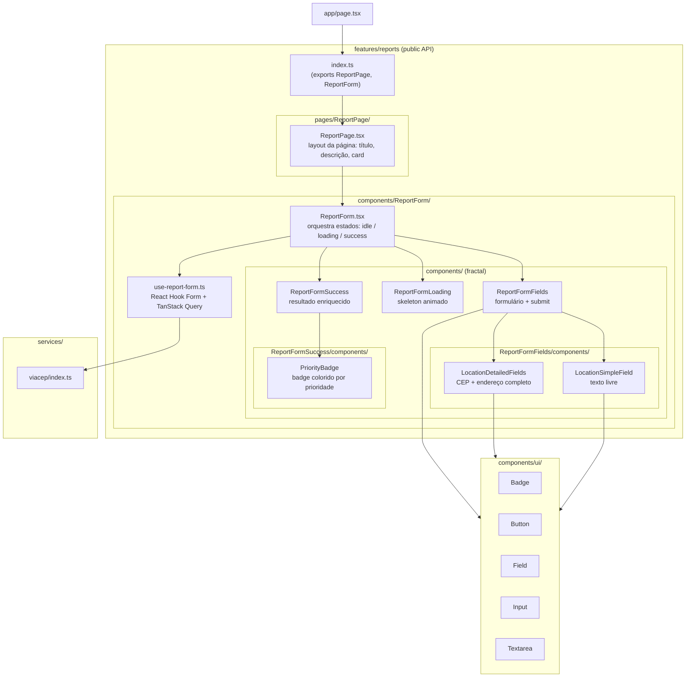

# Frontend — Zeladoria Inteligente

Interface do cidadão para submissão de relatos urbanos. Next.js + TypeScript + Tailwind CSS.

## Sumário

- [Arquitetura](#arquitetura)
- [Features](#features)
- [Componentes globais](#componentes-globais)
- [Executando localmente](#executando-localmente)
- [Variáveis de ambiente](#variáveis-de-ambiente)
- [Testes](#testes)

---

## Arquitetura

O frontend adota **vertical slices** (feature-based) com colocation fractal. O código vive tão perto quanto possível de onde é usado.

### Princípios

| Princípio               | Aplicação                                                                         |
| ----------------------- | --------------------------------------------------------------------------------- |
| **Colocation fractal**  | Componentes usados por apenas um pai vivem dentro desse pai em `components/`      |
| **Domain organization** | Organização por feature (`features/reports/`), não por tipo de arquivo            |
| **Boundary rules**      | Código externo importa **somente** de `@/features/reports` (o `index.ts` público) |
| **Relative imports**    | Dentro de uma feature, imports são relativos entre arquivos internos              |

### Estrutura de pastas

```
src/
├── app/                    # Routing Next.js, layout, providers — não importado por ninguém
│   ├── layout.tsx
│   ├── page.tsx
│   └── providers.tsx       # TanStack Query Provider
├── features/
│   └── reports/
│       ├── index.ts        # PUBLIC API — único arquivo que código externo importa
│       ├── pages/
│       │   └── ReportPage/              # página da feature (layout + ReportForm)
│       │       ├── ReportPage.tsx
│       │       └── index.ts
│       ├── components/
│       │   └── ReportForm/              # componente público da feature
│       │       ├── ReportForm.tsx
│       │       ├── index.ts
│       │       └── components/          # usados só pelo ReportForm (fractal)
│       │           ├── ReportFormFields/
│       │           │   ├── ReportFormFields.tsx
│       │           │   ├── index.ts
│       │           │   └── components/  # usados só pelo ReportFormFields (fractal)
│       │           │       ├── LocationDetailedFields/
│       │           │       └── LocationSimpleField/
│       │           ├── ReportFormLoading/
│       │           └── ReportFormSuccess/
│       │               └── components/  # usados só pelo ReportFormSuccess (fractal)
│       │                   └── PriorityBadge/
│       ├── hooks/
│       │   └── use-report-form.ts      # toda a lógica de estado do formulário
│       ├── requests/
│       │   └── create-report.ts        # POST /api/reports
│       ├── schemas/
│       │   └── report.schema.ts        # Zod + react-hook-form resolver
│       ├── types/
│       │   └── report.types.ts
│       ├── constants/
│       │   └── report-form.constants.ts
│       └── utils/
│           └── address.ts              # formatação de endereço para a API
├── components/
│   └── ui/                 # Componentes presentacionais globais reutilizáveis
│       ├── Badge/           # cva variants: danger, warn, success
│       ├── Button/          # cva variants: primary, secondary
│       ├── Field/           # wrapper estrutural sem variantes visuais
│       ├── Input/           # cn + readOnly condicional
│       ├── Textarea/        # cn + readOnly condicional
│       └── index.ts
├── services/
│   └── viacep/             # Wrapper ViaCEP (busca de endereço por CEP)
└── shared/
    └── cn.ts               # clsx + tailwind-merge
```

### Diagrama de componentes — feature `reports`



---

## Features

### `reports/`

Vertical slice completo para submissão e exibição de relatos.

#### `pages/ReportPage` — página da feature

Componente de página que expõe o fluxo de relatos: layout (título, descrição, card) e renderização do `ReportForm`. A rota Next.js (`app/page.tsx`) importa apenas `ReportPage` de `@/features/reports`.

#### `useReportForm` — hook central

Concentra toda a lógica de estado:

- `React Hook Form` com resolver Zod dinâmico (modo `simple` ou `detailed`)
- `TanStack Query` para mutações assíncronas (`cepMutation`, `reportMutation`)
- Dois modos de localização: texto livre (`simple`) ou endereço completo via CEP (`detailed`)

#### Modos de localização

| Modo       | Campos                                               | Validação                                                         |
| ---------- | ---------------------------------------------------- | ----------------------------------------------------------------- |
| `simple`   | `locationText` (texto livre)                         | mín. 3 caracteres                                                 |
| `detailed` | CEP + logradouro + número + bairro + cidade + estado | CEP obrigatório (8 dígitos); demais campos preenchidos via ViaCEP |

#### Estados do formulário

```
idle → loading → success
         ↑           ↓
         └── "Novo relato" (reset)
```

---

## Componentes globais

Todos em `src/components/ui/`.

| Componente | Padrão | Variantes                   |
| ---------- | ------ | --------------------------- |
| `Button`   | `cva`  | `primary`, `secondary`      |
| `Badge`    | `cva`  | `danger`, `warn`, `success` |
| `Field`    | `cn`   | — (wrapper estrutural)      |
| `Input`    | `cn`   | `readOnly` condicional      |
| `Textarea` | `cn`   | `readOnly` condicional      |

**Regra:** componentes com variantes visuais usam `cva`; sem variantes usam `cn` puro.

---

## Executando localmente

### Pré-requisitos

- Node.js 22+
- API rodando em `http://localhost:3001` — veja [apps/api/README.md](../api/README.md)

### Setup

```bash
cd apps/web

# 1. Configure as variáveis de ambiente
cp .env.example .env.local
# Edite .env.local

# 2. Instale dependências (se ainda não instalou na raiz)
npm install

# 3. Inicie o servidor de desenvolvimento
npm run dev
# Frontend em http://localhost:3000
```

---

## Variáveis de ambiente

| Variável              | Obrigatória | Padrão | Descrição                                     |
| --------------------- | ----------- | ------ | --------------------------------------------- |
| `NEXT_PUBLIC_API_URL` | Sim         | —      | URL base da API (ex: `http://localhost:3001`) |

Exemplo de `.env.local`:

```env
NEXT_PUBLIC_API_URL=http://localhost:3001
```

Em produção (Vercel), configure `NEXT_PUBLIC_API_URL` com a URL do API Gateway da AWS.

---

## Testes

```bash
# Dentro do app
cd apps/web
npm run test        # unit tests (Jest + React Testing Library)
npm run test:cov    # com cobertura

# Ou na raiz do monorepo
npm run test:web    # roda os testes do frontend
```

Os testes cobrem componentes individuais, o hook `useReportForm`, schemas Zod, requests e utilitários. Padrão **AAA (Arrange → Act → Assert)** em todos os arquivos.
